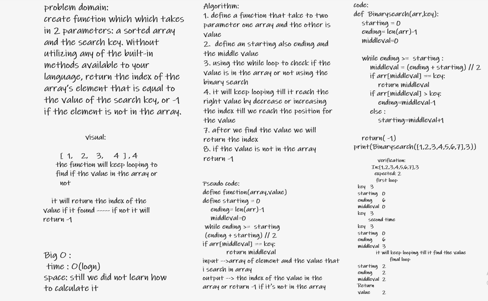

# Insert to Middle of an Array
function called BinarySearch which takes in 2 parameters: a sorted array and the search key. Without utilizing any of the built-in methods available to your language, return the index of the array’s element that is equal to the value of the search key, or -1 if the element is not in the array.

## Whiteboard Process

## Approach & Efficiency

I Approach that i should think of the problem and solve it using Logic

The Efficiency of the Big O time is O(logn)
