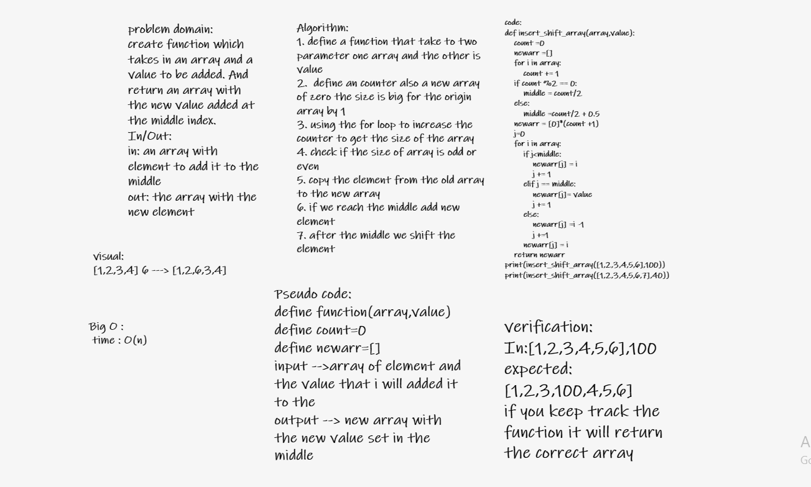

# Insert to Middle of an Array
Write a function called insertShiftArray which takes in an array and a value to be added, return an array with the new value added at the middle index .

## Whiteboard Process

## Approach & Efficiency

I Approach that i should think of the problem and solve it using Logic

The Efficiency of the Big O time is O(n)

