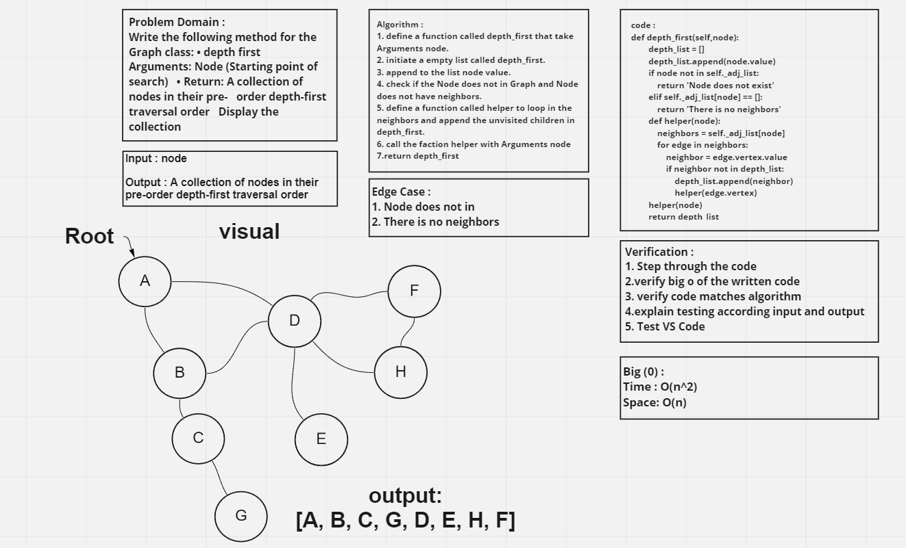

# Depth First Traversal

Depth First Traversal (or Search) for a graph is similar to Depth First Traversal of a tree. The only catch here is, unlike trees, graphs may contain cycles (a node may be visited twice).

## Challenge

create a function that take a start node (node to search) and the output will be path in DFS logic it will be a list of node.

## Approach & Efficiency

The Efficiency of the Big O time is O(n^2)

The Efficiency of the Big O space is O(n)

## Solution

