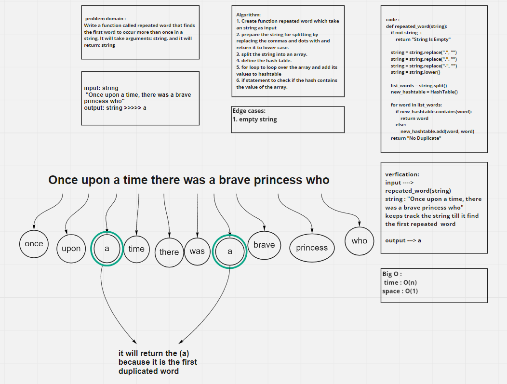

# Challenge Summary

Write a function called repeated word that finds the first word to occur more than once in a string.

## Whiteboard Process

## Approach & Efficiency

The Efficiency of the Big O time is O(n)

The Efficiency of the Big O space is O(1)

## Solution

Write a function called repeated word that finds the first word to occur more than once in a string

    Arguments: string

    Return: string
