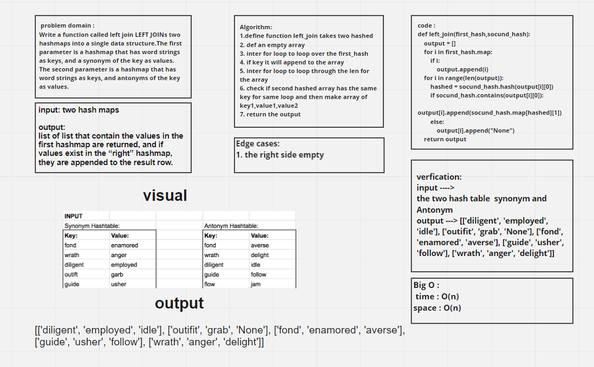

# Hashmap LEFT JOIN

The SQL LEFT JOIN returns all rows from the left table, even if there are no matches in the right table. This means that if the ON clause matches(zero) records in the right table; the join will still return a row in the result, but with NULL in each column from the right table. This means that a left join returns all the values from the left table, plus matched values from the right table or NULL in case of no matching join predicate.

## Challenge

Write a function called left join LEFT JOINs two hashmaps into a single data structure.

## Whiteboard Process

## Approach & Efficiency

The Efficiency of the Big O time is O(n)

The Efficiency of the Big O space is O(n)

## Solution

    Write a function called left join take two hash maps

        Arguments: two hash maps
        Return: list of list
