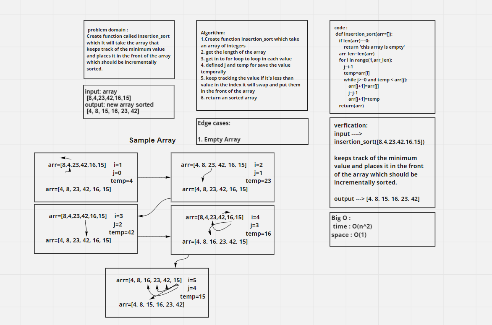

# Challenge Summary

Insertion Sort is a sorting algorithm that traverses the array multiple times as it slowly builds out the sorting sequence. The traversal keeps track of the minimum value and places it in the front of the array which should be incrementally sorted.

## Whiteboard Process

## Approach & Efficiency

The Efficiency of the Big O time is O(n^2)

The Efficiency of the Big O space is O(1)

## Solution

**It will take the array keeps track of the minimum value and places it in the front of the array which should be incrementally sorted.**

    function called insertion_sort
    Arguments: array
    Return: the array should be incrementally sorted
