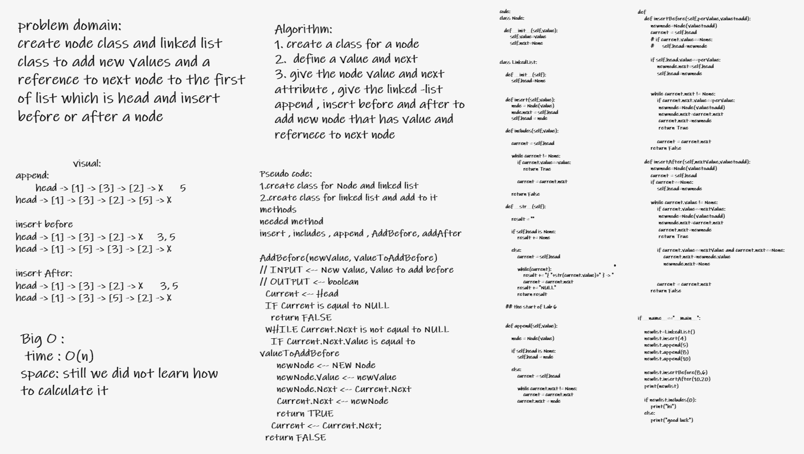

# Challenge Summary
**Build a linked list and insert to it nodes before or After a specifc node also insert to the Last Node**

## Whiteboard Process

## Approach & Efficiency

The Efficiency of the Big O time is O(n)

## Solution

### append function

**adds a new node with the given value to the end of the list**

### insert Before

**adds a new node with the given new value immediately before the first node that has the value specified**

### insert After

**adds a new node with the given new value immediately after the first node that has the value specified**

## Link For the code
 [The Linked List insertion link](python/code_challenges/linked_list/linked_list.py)
