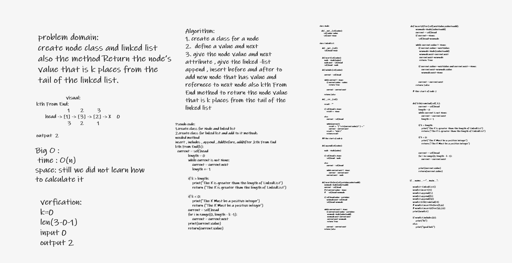

# Challenge Summary
**Build a linked list and Return the node’s value that is k places from the tail of the linked list.**

## Whiteboard Process

## Approach & Efficiency

The Efficiency of the Big O time is O(n)

## Solution

### kthFromEnd function

**Return the node’s value that is k places from the tail of the linked list**

## Link For the code
 [The Linked List insertion link](python/code_challenges/linked_list/linked_list.py)
