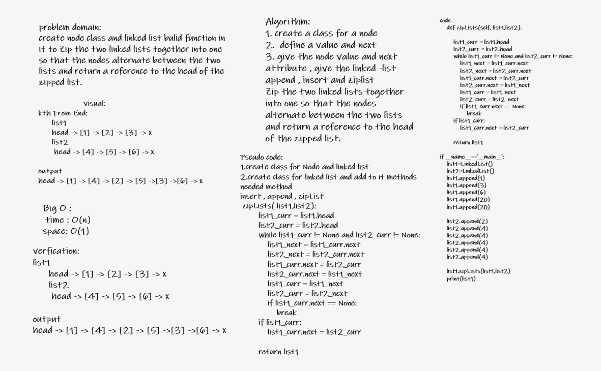

# Challenge Summary

**Build a linked list and bulid function in it to Zip the two linked lists together into one so that the nodes alternate between the two lists and return a reference to the head of the zipped list.**

## Whiteboard Process

## Approach & Efficiency

The Efficiency of the Big O time is O(n)
space is O(1)

## Solution

### zipLists function

**Zip the two linked lists together into one so that the nodes alternate between the two lists and return a reference to the head of the zipped list.**

