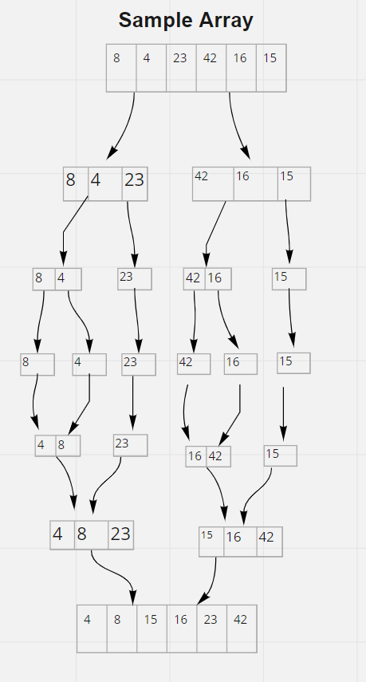

# Pseudo Code

    ALGORITHM Mergesort(arr)
    DECLARE n <-- arr.length

    if n > 1
      DECLARE mid <-- n/2
      DECLARE left <-- arr[0...mid]
      DECLARE right <-- arr[mid...n]
      // sort the left side
      Mergesort(left)
      // sort the right side
      Mergesort(right)
      // merge the sorted left and right sides together
      Merge(left, right, arr)

    ALGORITHM Merge(left, right, arr)
        DECLARE i <-- 0
        DECLARE j <-- 0
        DECLARE k <-- 0

        while i < left.length && j < right.length
            if left[i] <= right[j]
                arr[k] <-- left[i]
                i <-- i + 1
            else
                arr[k] <-- right[j]
                j <-- j + 1

            k <-- k + 1

        if i = left.length
        set remaining entries in arr to remaining values in right
        else
        set remaining entries in arr to remaining values in left

## Trace

## Sample Array: [8,4,23,42,16,15]

### pass 1
taking an array of integers to be sorted

### Pass 2:

The second pass through the array to split it in to two part and after that split it in parts till it reach one value

### Pass 3:

The third pass start to sort each one on the value incrementally sorted

### Pass 4:

The 4th pass through mereg the array togather

### Pass 5:

The 5th pass swap the the values to be sorted in the right order and return an ordered array or incrementally sorted.

