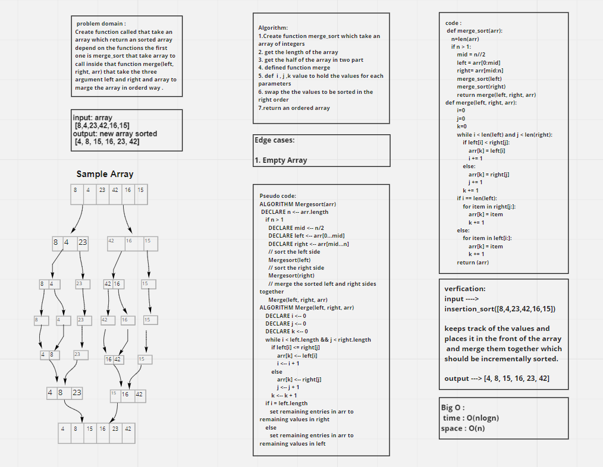

# Challenge Summary

write a function that take an array which return an sorted array depend on the functions the first one is merge_sort that take array to call inside that function merge(left, right, arr) that take the three argument left and right and array to marge the array in orderd way .

## Whiteboard Process

## Approach & Efficiency

The Efficiency of the Big O time is O(nlogn)

The Efficiency of the Big O space is O(n)

## Solution

**It will take the array  return an sorted array depend on the functions the first one is merge_sort that take array to call inside that function merge(left, right, arr) that take the three argument left and right and array to marge the array in orderd way**

    function called merge_sort
    Arguments: array
    Return: the array should be incrementally sorted
