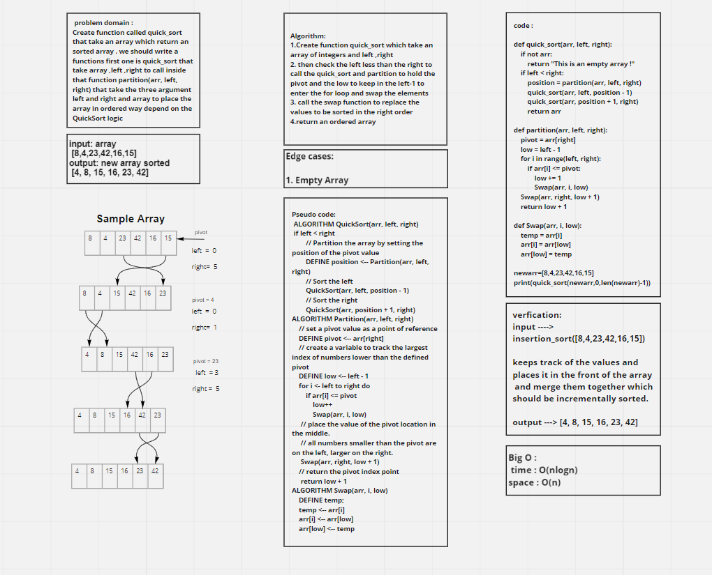

# Challenge Summary

write a function that take an array which return an sorted array depend on the functions the first one is QuickSort that take array to return sorted array depend on the QuickSort logic

## Whiteboard Process

## Approach & Efficiency

The Efficiency of the Big O time is O(nlogn)

The Efficiency of the Big O space is O(1)

## Solution

**It will take the array to return an sorted array depend on the functions the first one is quick_sort that take array ,left ,right to call inside that function partition(arr, left, right) that take the three argument left and right and array to place the array in ordered way**

    function called quick_sort
    Arguments: array,left, right
    Return: the array should be incrementally sorted
