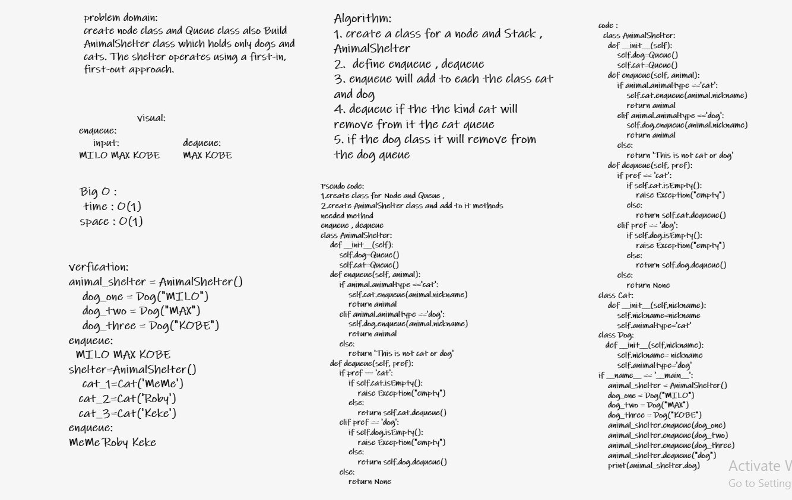

# Challenge Summary

**Create a class called AnimalShelter which holds only dogs and cats. The shelter operates using a first-in, first-out approach.**

## Whiteboard Process

## Approach & Efficiency

The Efficiency of the Big O time is O(1)

## Solution

### enqueue

**Add to the Queue dog if the the animal is dog ... add to Queue cat if the animal is cat**

### dequeue

**remove from the Queue dog if the the animal is dog ... remove from Queue cat if the animal is cat**
