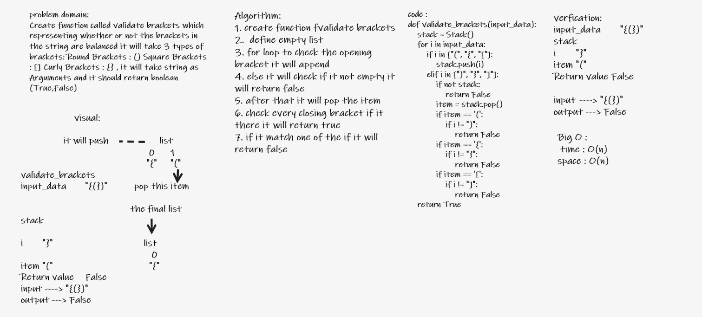

# Challenge Summary

**Create function called validate brackets which representing whether or not the brackets in the string are balanced it will take 3 types of brackets: Round Brackets : () Square Brackets : [] Curly Brackets : {}**

## Whiteboard Process

## Approach & Efficiency

The Efficiency of the Big O time is O(n)

## Solution

**function validate brackets it will take string as Arguments and it should return boolean (True,False)**
