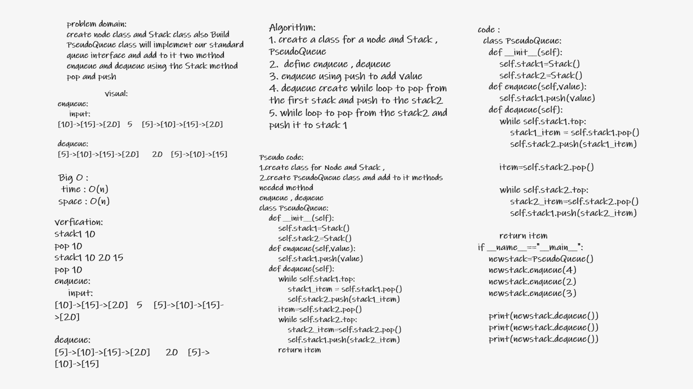

# Challenge Summary

**Build PseudoQueue class will implement our standard queue interface and add to it two method enqueue and dequeue using the Stack method pop and push**

## Whiteboard Process

## Approach & Efficiency

The Efficiency of the Big O time is O(n)

The Efficiency of the Big O space is O(n)

## Solution

### enqueue

**Add to PseudoQueue class by using the push method from the Stack , using a first-in, first-out approach**

### dequeue

**Add to PseudoQueue class by useing the pop method from the stack , using a first-in, first-out approach**
