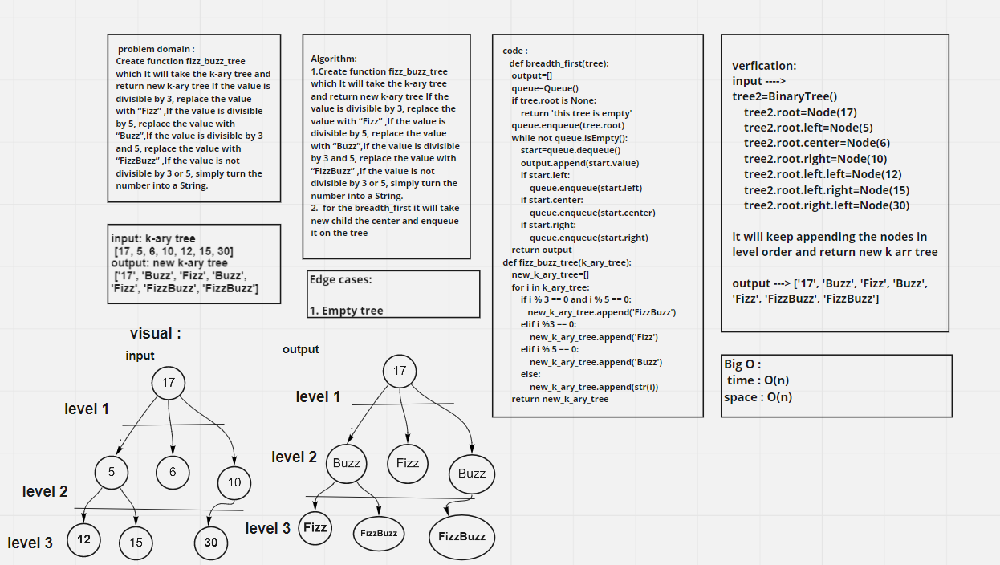

# challenge 18

### Challenge Summary

**Create function fizz_buzz_tree which It will take the k-ary tree and return new k-ary tree If the value is divisible by 3, replace the value with “Fizz” ,If the value is divisible by 5, replace the value with “Buzz”,If the value is divisible by 3 and 5, replace the value with “FizzBuzz” ,If the value is not divisible by 3 or 5, simply turn the number into a String.**

## Whiteboard Process

## Approach & Efficiency

The Efficiency of the Big O time is O(n)
The Efficiency of the Big O space is O(n)

## Solution

### fizz_buzz_tree

**It will take the k-ary tree and return new k-ary tree If the value is divisible by 3, replace the value with “Fizz” ,If the value is divisible by 5, replace the value with “Buzz”,If the value is divisible by 3 and 5, replace the value with “FizzBuzz” ,If the value is not divisible by 3 or 5, simply turn the number into a String.**

    function called fizz_buzz_tree
    Arguments: k-ary tree
    Return: new k-ary tree
