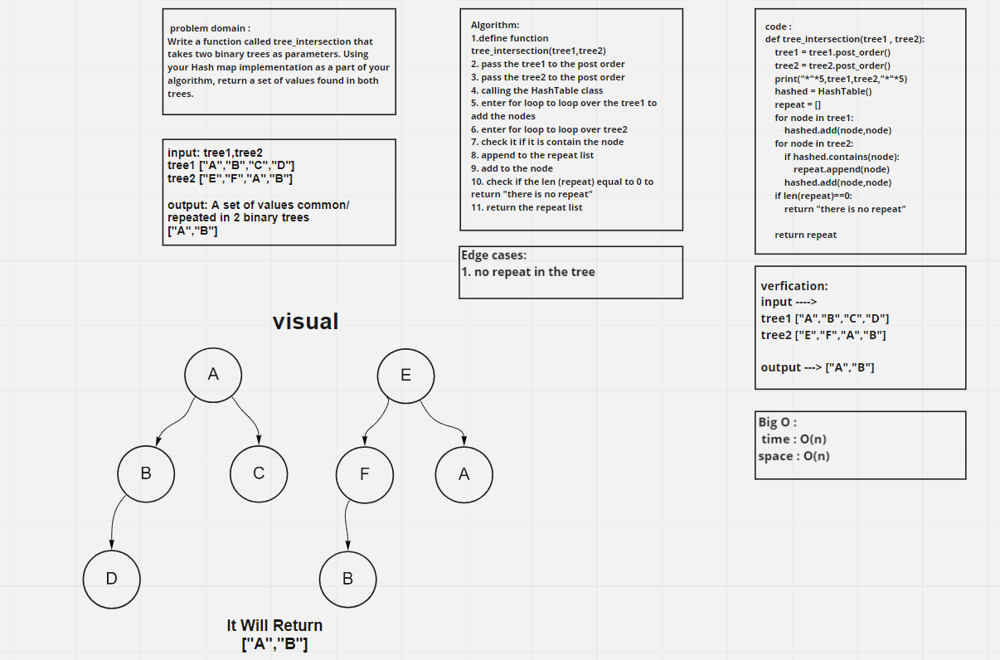

# Challenge Summary

Write a function called tree_intersection that takes two binary trees as parameters.Using your Hashmap implementation as a part of your algorithm, return a set of values found in both trees.

## Whiteboard Process

## Approach & Efficiency

The Efficiency of the Big O time is O(n)

The Efficiency of the Big O space is O(n)

## Solution

Write a function called tree_intersection that takes two binary trees as parameters.

    Arguments: tree1,tree2

    Return: return a set of values common/ repeated  in 2 binary trees.
