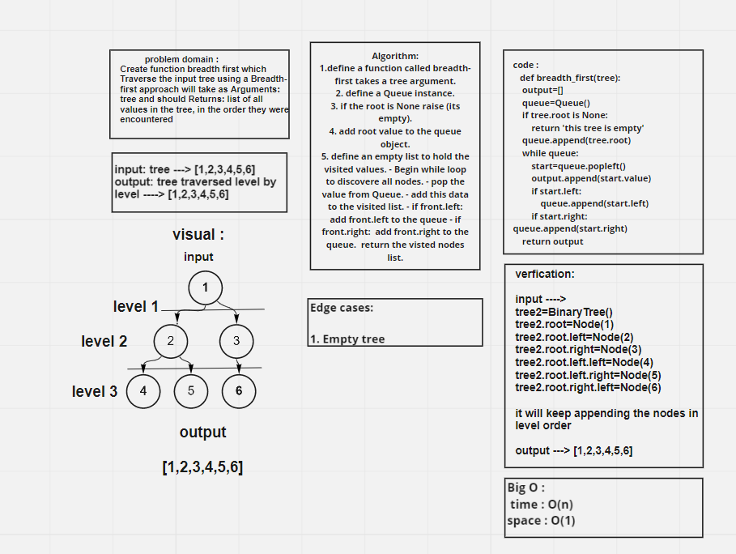
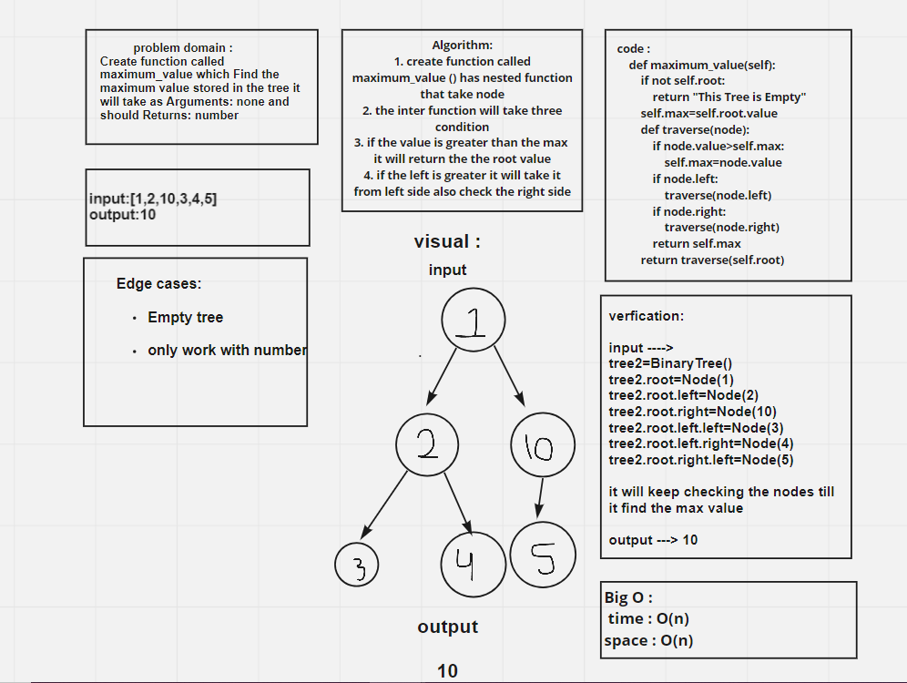

# challenge 17

### Challenge Summary

**Create function breadth first which Traverse the input tree using a Breadth-first approach**

## Whiteboard Process

## Approach & Efficiency

The Efficiency of the Big O time is O(n)
The Efficiency of the Big O space is O(1)

## Solution

### breadth first

**It will take the tree and return list of all values in the tree, in the order they were encountered**

    function called breadth first
    Arguments: tree
    Returns: list of all values in the tree, in the order they were encountered

____________________________

## challenge 16

### Challenge Summary

**Create function called maximum_value which Find the maximum value stored in the tree**

## Whiteboard Process

## Approach & Efficiency

The Efficiency of the Big O time is O(n)
The Efficiency of the Big O space is O(n)

## Solution

### maximum_value

**It will take the nodes and check the max value and return it**

    find maximum value
    Arguments: none
    Returns: number

____________________________

## Trees

**a binary tree is a tree data structure in which each node has at most two children, which are referred to as the left child and the right child. Traversal is a process to visit all the nodes of a tree and may print their values too. Because, all nodes are connected via edges (links) we always start from the root (head) node.**

## Challenge & API

* Node class : Create a Node class that has properties for the value stored in the node, the left child node, and the right child node

* Create a Binary Tree class:

    contaning three method:

    - Pre-order: return an array having value in order of this depth first traversal   root >> left >> right

    - In-order: return an array having value in order of this depth first traversal    left >> root >> right

    - Post-order: return an array having value in order of this depth first traversal  left >> right >> root

* Create a Binary Search Tree class:

    contaning additional methods

    - Add : Adds a new node with that value in the correct location in the binary search tree.

    - Contains : Returns boolean indicating whether or not the value is in the tree at least once.

## Approach & Efficiency

The Efficiency of the Big O time is O(n)

